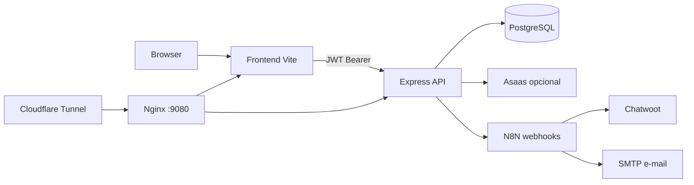

# 2. Arquitetura

## 2.1. Monorepo

```
Casa da Paz/
├── agents.md                 # Orquestração de agentes (canônico)
├── frontend/                 # React ERP + portal público
├── backend/                  # Express + Prisma
├── ai-service/               # Python FastAPI
├── infra/                    # Docker, Nginx, deploy
├── specs/                    # Specs SDD por feature
├── .specify/memory/          # Memória viva Spec Kit
├── .cursor/skills/           # Skills de agentes
└── docs/                     # Documentação e contratos
```

## 2.2. Camadas



### Frontend
- SPA React Router: `/public/*` (anônimo) e `/app/*` (autenticado)
- i18n pt-BR / en (`frontend/src/i18n/`)
- UI oculta recursos sem grant — **autorização real no backend**

### Backend
- Rotas em `backend/src/routes/`
- Policies em `backend/src/policies/rbac.ts`
- Jobs (ex.: geração de mensalidades) no boot Express
- Migrations Prisma em `backend/prisma/migrations/`

### Integrações
| Sistema | Uso |
|---------|-----|
| Asaas | Cobranças/assinaturas — **dormant** sem chave |
| N8N | Alertas financeiros, agendamentos, **delegações (033)** |
| Chatwoot | Atendimento WhatsApp (inbox Meta pendente polish) |
| SMTP | E-mail via N8N (credencial `SMTP Casa da Paz` — configurar) |
| Cloudflare Images | Upload portal (quando tokens presentes) |

## 2.3. Princípios (constitution)

1. Spec antes de código (SDD)
2. Autorização no backend sempre
3. Adimplência derivada (ADR-003) — não duplicar status
4. Import Excel atômico
5. Deploy VPS só com confirmação humana
6. Tesouraria **não depende** de Asaas
7. Estoques separados: primário (casa) ≠ livraria/PDV ≠ ingressos futuros (ADR-010)
8. Delegações (033) separadas do checklist de limpeza do estoque (ADR-011)
